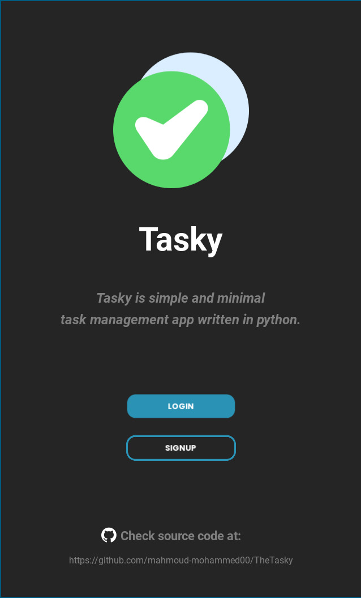
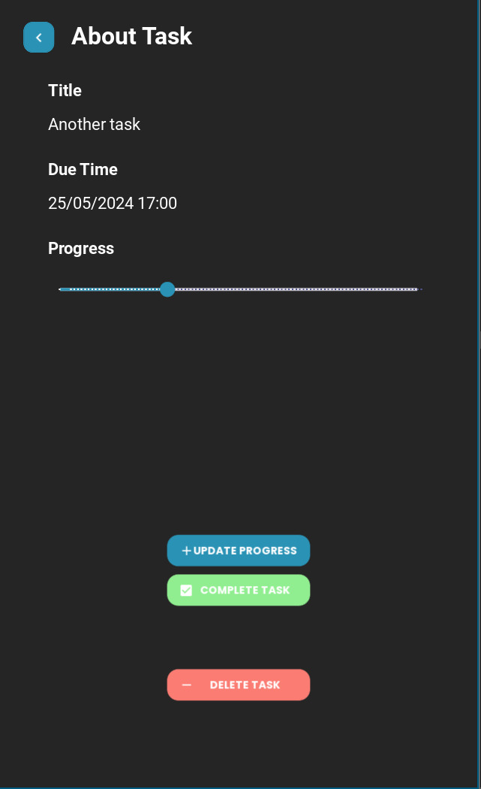

# Tasky
Task management app in Python

<p align="center">
  
   
   
   
   
</p>

<p align="center">
  
   
   
   
   
</p>


## Installation

- Install dependencies,
```sh
$ pip install -r requirements.txt
```

## Usage

In one terminal tab, execute the server 
```sh
$ uvicorn main:app
```

In another tab, execute the gui,
```sh
$ python3 app.py
```
